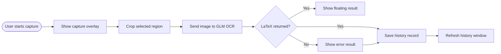

# Formula Recognition

> **English** | [中文](README.md)

*A Windows desktop formula recognition tool — screenshot, GLM vision OCR, LaTeX output, history records, system tray, and packaged exe.*

---

## Features

- System tray residency with main window, capture, settings, and exit
- Multi-monitor drag-select overlay (including external displays)
- GLM vision model for mathematical formula recognition → LaTeX
- Floating result toast (5-second fade-out with fade-in/fade-out animation)
- Optional automatic clipboard copy
- Editable LaTeX source panel with live formula preview
- Auto-refreshing Markdown history records (per-day directories)
- Soft blue UI theme with rounded controls
- Global screenshot hotkey, default `Ctrl+Alt+M`
- Close-to-tray behavior by default

## How it works



## Quick start

### Requirements

- Windows desktop environment
- Python ≥ 3.8
- Network access to a GLM API endpoint
- A valid GLM API key

### Install & run

```bash
pip install -r requirements.txt
python app.py
```

`data/config.json` is auto-created on first launch. Open the settings window and fill in your API key.

### Build exe

```powershell
powershell -ExecutionPolicy Bypass -File scripts/build_exe.ps1
```

Output: `dist/FormulaRecognition/FormulaRecognition.exe`

## User manual

Detailed usage instructions can be found in **[USER_MANUAL.md](USER_MANUAL.md)** (Chinese).

## Configuration

Runtime configuration is stored in `data/config.json` (gitignored).

| Field | Description | Default |
|-------|-------------|---------|
| `glm.api_key` | GLM API Key | `""` |
| `glm.endpoint` | API base URL | `""` (auto-appends `/chat/completions`) |
| `glm.model` | Model name | `glm-4.1v-thinking-flashx` |
| `hotkey` | Global capture hotkey | `ctrl+alt+m` |
| `history_dir` | History directory | `data/history` |
| `auto_copy` | Auto-copy to clipboard | `true` |
| `save_screenshot` | Save screenshot image | `true` |
| `close_to_tray` | Hide to tray on close | `true` |
| `strip_latex_delimiters` | Strip LaTeX delimiters on copy | `true` |

## Project structure

```
formula_recognition/
├── app.py                          # Entry point + dependency wiring
├── formula_recognition/
│   ├── capture/                    # Multi-monitor capture overlay
│   ├── ui/                         # Main window, settings, toast, formula preview
│   ├── config.py                   # Config load/save
│   ├── ocr.py                      # GLM OCR client
│   ├── history.py                  # Markdown history store
│   ├── hotkey.py                   # Global hotkey registration
│   ├── tray.py                     # System tray controller
│   ├── workflow.py                 # Workflow orchestration
│   └── paths.py                    # Path utilities
├── data/config.json                # Runtime config (gitignored)
├── data/history/                   # History records (gitignored)
├── scripts/build_exe.ps1           # Build script
├── formula_recognition.spec        # PyInstaller spec
├── AGENTS.md                       # AI assistant guide
└── USER_MANUAL.md                  # User manual (Chinese)
```

## Known limits

- Hotkey changes require an app restart before re-registration
- Formula preview is lightweight Qt rich text; does not implement every LaTeX package or environment
- Manual GUI verification is still needed for tray, hotkey, and drag-selection behavior

## Security & privacy

- Do not commit `data/config.json` — it may contain a real API key
- History records and screenshots may contain sensitive screen content
- Prefer a private history directory when recognizing confidential formulas

## License

No license file is currently included. Add a `LICENSE` file before publishing if you want to grant reuse rights.
