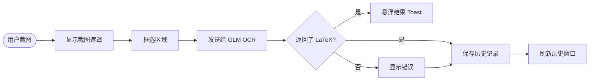

# Formula Recognition

> [English](README.en.md) | **中文**

*Windows 桌面公式识别工具 —— 截图、GLM 视觉识别、LaTeX 输出、历史记录、托盘驻留、打包 exe。*

---

## 功能

- 常驻系统托盘，支持主窗口、截图、设置、退出
- 多屏幕截图框选（含外接显示器）
- GLM 视觉大模型识别数学公式，输出 LaTeX
- 识别结果以悬浮 Toast 展示（5 秒淡出，带淡入淡出动画）
- 可选自动复制 LaTeX 到剪贴板
- LaTeX 源码区可编辑，公式预览实时更新
- 历史记录自动刷新，按日保存 Markdown 文件
- 柔和蓝色 UI 主题，圆角控件
- 全局截图热键，默认 `Ctrl+Alt+M`
- 关闭主窗口时默认隐藏至托盘

## 工作原理



## 快速开始

### 环境要求

- Windows 桌面环境
- Python ≥ 3.8
- 网络可访问 GLM API 端点
- 有效的 GLM API Key

### 安装 & 运行

```bash
pip install -r requirements.txt
python app.py
```

首次运行会自动生成 `data/config.json`。打开设置界面填写 API Key 即可使用。

### 打包 exe

```powershell
powershell -ExecutionPolicy Bypass -File scripts/build_exe.ps1
```

输出：`dist/FormulaRecognition/FormulaRecognition.exe`

## 配置

运行时配置保存在 `data/config.json`（已加入 `.gitignore`，不会误提交）。

| 字段 | 说明 | 默认值 |
|------|------|--------|
| `glm.api_key` | GLM API Key | `""` |
| `glm.endpoint` | API 基础地址 | `""`（自动拼接 `/chat/completions`） |
| `glm.model` | 模型名 | `glm-4.1v-thinking-flashx` |
| `hotkey` | 全局截图热键 | `ctrl+alt+m` |
| `history_dir` | 历史记录目录 | `data/history` |
| `auto_copy` | 自动复制到剪贴板 | `true` |
| `save_screenshot` | 保存截图文件 | `true` |
| `close_to_tray` | 关闭主窗口时隐藏至托盘 | `true` |
| `strip_latex_delimiters` | 复制时去除 LaTeX 外围标记 | `true` |

## 项目结构

```
formula_recognition/
├── app.py                          # 入口 + 依赖装配
├── formula_recognition/
│   ├── capture/                    # 多屏截图遮罩
│   ├── ui/                         # 主窗口、设置、Toast、公式预览
│   ├── config.py                   # 配置加载与保存
│   ├── ocr.py                      # GLM OCR 客户端
│   ├── history.py                  # Markdown 历史记录
│   ├── hotkey.py                   # 全局热键
│   ├── tray.py                     # 系统托盘
│   ├── workflow.py                 # 工作流编排
│   └── paths.py                    # 路径工具
├── data/config.json                # 运行时配置（已忽略）
├── data/history/                   # 历史记录（已忽略）
├── scripts/build_exe.ps1           # 打包脚本
├── formula_recognition.spec        # PyInstaller 配置
├── AGENTS.md                       # AI 助手指南
└── USER_MANUAL.md                  # 用户说明书
```

## 已知限制

- 修改热键后需重启应用才能重新注册
- LaTeX 预览为轻量 Qt 富文本渲染，不支持所有 LaTeX 宏包
- 托盘、热键、拖拽选框的行为需要实际 GUI 验证

## 安全 & 隐私

- `data/config.json` 可能包含 API Key，**禁止提交**到版本控制
- 历史记录和截图可能包含敏感屏幕内容
- 建议使用专用历史目录存储机密公式


