# Formula Recognition

_A Windows desktop formula recognition tool with tray residency, screenshot capture, GLM vision OCR, history records, and packaged exe output._

---

Formula Recognition is a PySide6 desktop application for capturing formulas from the screen and converting them to LaTeX. It is designed to stay in the Windows system tray, support multi-monitor screenshot selection, save Markdown history records, and provide a lightweight rendered preview for recognized formulas.

## Features

- Resident system tray app with main window, screenshot, settings, and exit actions
- Main menu bar exposes `截图`, `设置`, and `退出` as direct top-level actions
- Main history window with record table, raw LaTeX detail, and formula preview
- Editable LaTeX detail panel with live formula preview updates
- History window refreshes automatically after each recognition record is written
- Soft desktop UI theme with rounded controls, calm colors, and readable spacing
- Global screenshot hotkey, default `Ctrl+Alt+M`
- Multi-monitor capture overlay, including external displays
- GLM vision OCR via chat-completions compatible endpoint
- Floating result toast that fades after 5 seconds
- Floating result toast with fade-in and fade-out animation
- Optional automatic clipboard copy
- Configurable model, API endpoint, API key, hotkey, and history directory
- Optional screenshot persistence alongside Markdown history records
- Close-to-tray behavior controlled by settings
- PyInstaller onedir packaging for Windows release

## How it works

```mermaid
flowchart LR
    accTitle: Formula Recognition Workflow
    accDescr: Formula recognition flow from user capture through OCR, result presentation, and history persistence.

    user_capture([User starts capture]) --> screen_overlay[Show capture overlay]
    screen_overlay --> selected_region[Crop selected region]
    selected_region --> glm_ocr[Send image to GLM OCR]
    glm_ocr --> latex_result{LaTeX returned?}
    latex_result -->|Yes| show_toast[Show floating result]
    latex_result -->|Yes| save_history[Save history record]
    latex_result -->|No| show_error[Show error result]
    show_error --> save_history
    save_history --> history_window[Refresh history window]

    classDef start fill:#ede9fe,stroke:#7c3aed,stroke-width:2px,color:#3b0764
    classDef process fill:#dbeafe,stroke:#2563eb,stroke-width:2px,color:#1e3a5f
    classDef decision fill:#fef9c3,stroke:#ca8a04,stroke-width:2px,color:#713f12
    classDef success fill:#dcfce7,stroke:#16a34a,stroke-width:2px,color:#14532d

    class user_capture start
    class screen_overlay,selected_region,glm_ocr,show_toast,show_error,save_history process
    class latex_result decision
    class history_window success
```



## Project structure

| Path | Purpose |
| --- | --- |
| `app.py` | Application entry point and dependency wiring |
| `formula_recognition/` | Core package for config, OCR, capture, history, tray, UI, and workflow |
| `formula_recognition/capture/` | Multi-screen geometry and screenshot overlay |
| `formula_recognition/ui/` | Main window, settings window, result toast, and formula preview |
| `tests/` | Pytest suite for app assembly, OCR, workflow, UI, packaging, and history |
| `data/config.example.json` | Safe example configuration for new users |
| `USER_MANUAL.md` | End-user manual in Chinese |
| `PROGRESS.md` | Maintainer progress notes |
| `AGENTS.md` | Contributor and agent guide |
| `scripts/build_exe.ps1` | Windows PyInstaller build script |

## Requirements

- Windows desktop environment
- Python 3.8 or newer
- Network access to your configured GLM API endpoint
- A valid GLM API key

Install runtime dependencies:

```bash
pip install -r requirements.txt
```

Install development and packaging dependencies:

```bash
pip install -r requirements-dev.txt
```

## Configuration

Runtime configuration is stored at `data/config.json`. This file is ignored by Git because it can contain secrets.

Start from the example:

```powershell
Copy-Item data/config.example.json data/config.json
```

Then edit `data/config.json` or use the in-app settings window:

```json
{
  "glm": {
    "api_key": "sk-your-api-key",
    "endpoint": "https://open.bigmodel.cn/api/paas/v4",
    "model": "GLM-4V-Flash"
  },
  "hotkey": "ctrl+alt+m",
  "history_dir": "data/history",
  "auto_copy": true,
  "save_screenshot": true,
  "close_to_tray": true
}
```

`endpoint` may be a GLM base URL such as `https://open.bigmodel.cn/api/paas/v4`; the app normalizes it to `/chat/completions` for GLM requests.

## Run locally

```bash
python app.py
```

The app opens the main history window and creates a system tray icon. Closing the main window hides it by default; use the tray or menu `退出` action to fully exit.

## Usage

1. Open `设置` and configure your API key, endpoint, model, and history directory.
2. Start recognition from the main menu, tray menu, or the default `Ctrl+Alt+M` hotkey.
3. Drag-select a formula region on any connected screen.
4. Review the floating result toast and the saved record in the main history window.
5. Use the history detail panel to inspect raw LaTeX and the lightweight formula preview.

## Testing

Run the full test suite:

```bash
python -m pytest tests -v
```

The suite uses fakes for OCR, capture, and UI-facing collaborators where possible. Real desktop verification is still recommended for tray visibility, global hotkeys, and manual drag selection.

## Build a Windows exe

Install dev dependencies first, then run:

```powershell
powershell -ExecutionPolicy Bypass -File scripts/build_exe.ps1
```

The release artifact is written to:

```text
dist/FormulaRecognition/FormulaRecognition.exe
```

`dist/` and `build/` are ignored by Git. Attach packaged artifacts to GitHub Releases instead of committing them.

## Release checklist

- Run `python -m pytest tests -v`
- Run `python app.py` and verify it stays resident with an empty stderr
- Build with `scripts/build_exe.ps1`
- Smoke-test `dist/FormulaRecognition/FormulaRecognition.exe`
- Confirm `data/config.json` contains no real API key before sharing logs or screenshots
- Confirm generated `data/history/`, `build/`, and `dist/` files are not staged
- Add a repository license before public distribution if reuse terms matter

## Security and privacy

- Do not commit `data/config.json`; it may contain a real API key
- History records and screenshots may contain sensitive screen content
- Prefer a private history directory when recognizing confidential formulas
- Review generated Markdown records before sharing them publicly

## Known limits

- Hotkey changes require an app restart before re-registration
- GLM responses may not include confidence, so confidence can be empty
- Formula preview is lightweight Qt rich text and does not implement every LaTeX package or environment
- Manual GUI verification is still needed for tray, hotkey, and drag-selection behavior

## License

No license file is currently included. Add a `LICENSE` file before publishing if you want to grant reuse rights.
